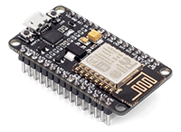
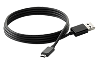
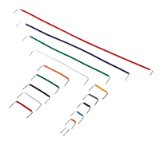
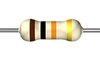
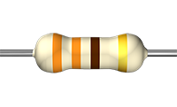

---
---
# Componentes

## ESP8266 NodeMCU 1.0 Microcontroller

Este microcontrolador é parte central do projeto, ele é o responsável pelo controle de todos os outros componentes e de fazer a comunicação com a página web onde os vídeos serão apresentados ao público. Ele pode ser programado com a linguagem padrão do Arduino e conta com uma antena Wi-Fi, sendo ideal para IoT.

## 830 Points Breadboards

Para facilitar a prototipagem do projeto, como fizemos de maneira gradual, soldar as peças a todo momento seria um problema, para isso servem as Protoboards/Breadboards. Com isso ao invés da solda, simplesmente usamos os Jumpers subcitados para fazer a passagem de corrente eletrica. Saiba mais[Protoboard].  

## Cabo Micro USB

Usado tanto para alimentar a placa ESP8266 quanto para transferencia de arquivos do computador.

## Jumpers

Além dos jumpers rígidos originais oferecidos para o projeto e dos jumpers "flexíveis" macho-femea, utilizamos jumpers macho-macho para facilitar devido a sobreposição de jumpers rígidos e ausencia do tamanho ideal na hora de conectar certos componentes.

## Resistores

### 10kΩ Resistor

Utilizado para controlar o fluxo de energia no circuito, essencial para o funcionamento do [PushButton] para controlar os estados _Pressionado_ e _Não Pressionado_.

### 330Ω Resistor

Utilizado para previnir danos ao microcontrolador e para alimentar os LEDs de maneira a não queimá-los;

Saiba mais [Resistores]

_ Adaptado de [Pincello]/[Essentials] _

## PushButton

## Sensor Ultrassônico de Presença

## LEDs RGB

## LEDs Brancos

[//]: # (Referências
To-do: Adicionar imagens do projeto
Adicionar links para pushbutton, resistores e ultrassom
)

   [Essentials]: <https://efduarte.github.io/pincello/#/essentials>
   [Pincello]: <https://efduarte.github.io/pincello/#/>
   [Protoboard]: <https://learn.sparkfun.com/tutorials/how-to-use-a-breadboard>
   [PushButton]:
   [Resistores]:
   